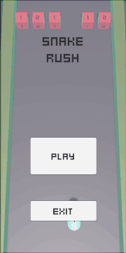
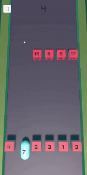

#  Endless-Rush

## Game preview :movie_camera:

[  ](https://simmer.io/@Krecker/snake-rush "Play it online")

## Gameplay :video_game:

### How to control
PC: Use the A + D buttons.

Android: Rotate your smartphone.

### Goal

Score as many points as possible.

## Getting Started :traffic_light:
This project requires Unity3D (2019.4.24f1+) to build and run. Clone this repository and open the root folder in Unity.

## Libraries and Resources Used :books:

* [Kenney Fonts](https://www.kenney.nl/assets/kenney-fonts)
* [Music (freesound)](https://freesound.org/)
  * [Atmospheric Video Game Tune](https://freesound.org/people/SRJA_Gaming/sounds/545392/)
  * [Nodens](https://freesound.org/people/axtoncrolley/sounds/172707/)
  * [magiccap gameover](https://freesound.org/people/vanceparley/sounds/412082/)
  * [clinthammermusic-gamerstep-bass-triplets](https://freesound.org/people/Clinthammer/sounds/179511/)

## Game Features :checkered_flag:
- [X] Camera follow
- [X] Heal objects that restore health
- [X] Objects health displayed
- [X] Text directed towards the camera
- [X] Points scoring
- [X] Score displayed
- [X] Max score saved to the memory
- [X] UI manager
- [X] Audio manager
- [X] Input handler for Android and PC
- [X] Auto generated levels
- [ ] Set the movement at touches on the Android

## ToDo :bookmark_tabs:
- [X] Release the game
- [X] Create README file for this game

- [ ] Download new assets and redesign the visual of the game
